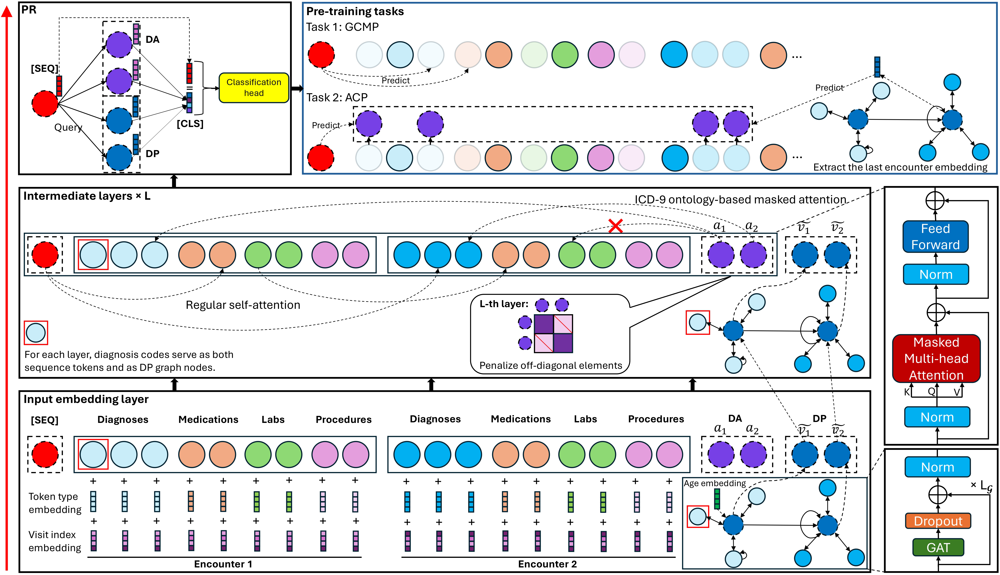

# DT-BEHRT: Disease Trajectory-Aware Transformer for Interpretable Patient Representation Learning

## Abstract
The growing adoption of electronic health record (EHR) systems offers substantial opportunities for predictive modeling to support clinical decision making. Unlike traditional static data, structured EHRs form longitudinal trajectories of hospital visits, each consisting of diverse medical codes. Existing sequence-based, graph-based, and graph-enhanced sequence approaches aim to capture temporal dependencies and code interactions, but often treat all code types equally and overlook the central role of diagnosis codes in disease trajectories. We propose the **Disease Trajectory-aware Transformer for EHR (DT-BEHRT)**, a graph-enhanced sequence architecture that fully leverages diagnosis codes to explicitly encode ontology-guided disease interactions within organ/system categories and to model progression patterns, thereby forming clinically aligned patient representations. To strengthen learning, we design a tailored pre-training framework that combines trajectory-level code masking with ontology-guided ancestor prediction. Extensive experiments on multiple tasks show that DT-BEHRT achieves strong predictive performance while providing strong interpretability that mirrors physicians’ reasoning about disease progression.

## Model Architecture

## Requirements
The implementation of **DT-BEHRT** has been tested with the following environment:

- Python == 3.10.18  
- PyTorch == 1.13.1  
- PyTorch Geometric == 2.7.0  
- tqdm  
- scikit-learn == 1.7.0  
- scipy == 1.15.3  
- numpy == 1.26.4 

## Replicating the Results
1. **Download the raw data**  
   From the [MIMIC-III dataset](https://physionet.org/content/mimiciii/1.4/), obtain the following files (**no need to unzip**):  
   - `ADMISSIONS.csv.gz`  
   - `DIAGNOSES_ICD.csv.gz`  
   - `LABEVENTS.csv.gz`  
   - `PATIENTS.csv.gz`  
   - `PRESCRIPTIONS.csv.gz`  
   - `PROCEDURES_ICD.csv.gz`  

   Similarly, download the corresponding files from the [MIMIC-IV dataset](https://physionet.org/content/mimiciv/3.1/) (located in the `hosp` folder).  
   Place the files into the following directories:  
   - `./data_process/MIMIC-III-raw`  
   - `./data_process/MIMIC-IV-raw`  

2. **Preprocess the data**  
   Run the notebooks:  
   - `MIMIC-III.ipynb`  
   - `MIMIC-IV.ipynb`  
   
   These notebooks will perform the necessary preprocessing steps and prepare the datasets for modeling.  

3. **Evaluate the model**  
   Run the notebook **`test_model.ipynb`**.  
   - To evaluate performance on different tasks, adjust the `task_index` in the configuration file:  
     - `0`: In-hospital mortality  
     - `1`: Readmission  
     - `2`: Prolonged length of stay (PLOS)  
     - `3`: Phenotyping prediction  